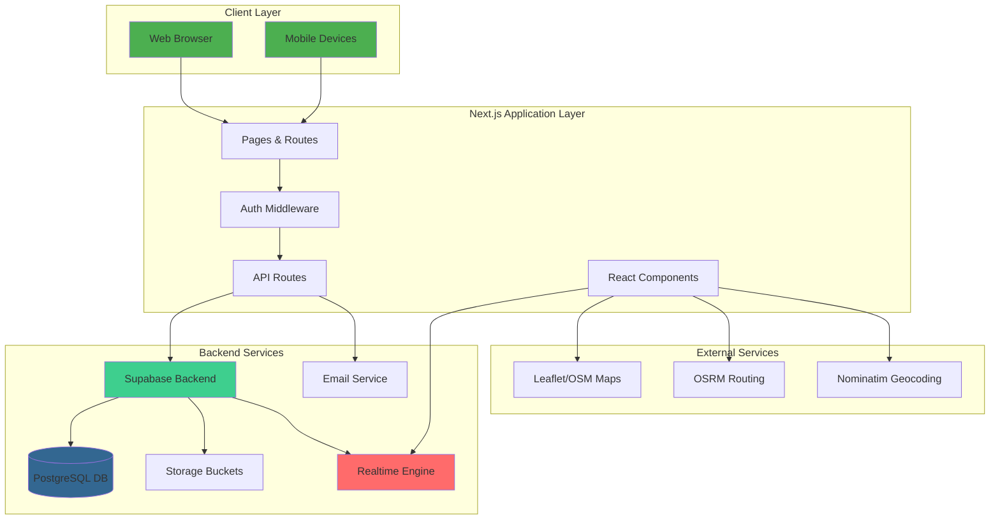
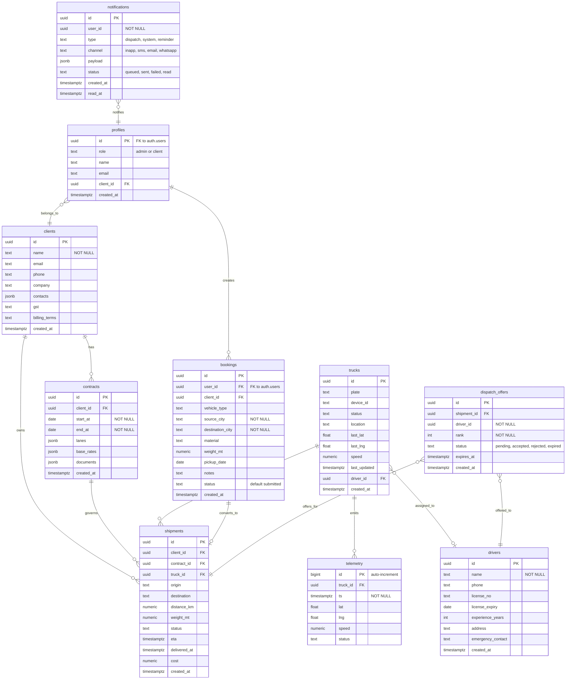
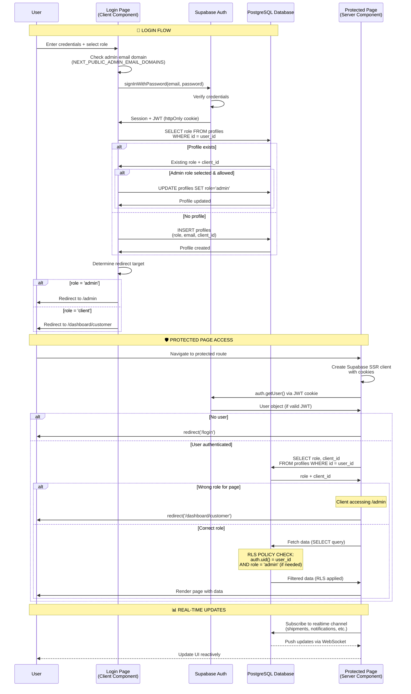
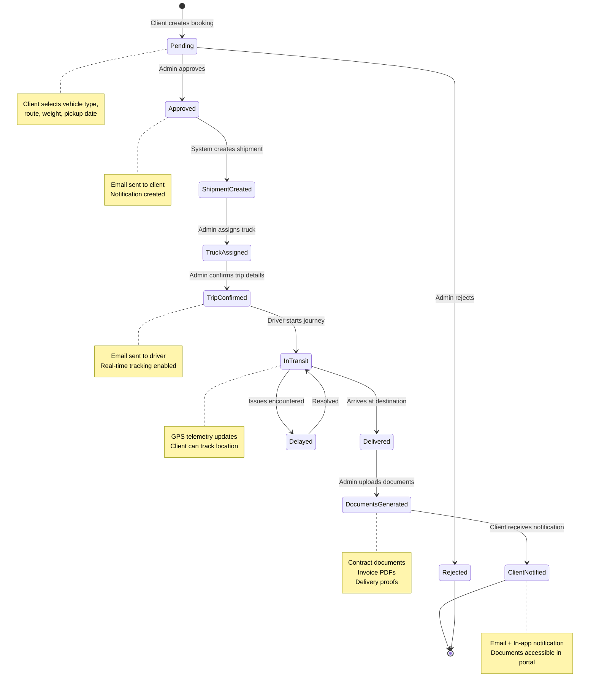
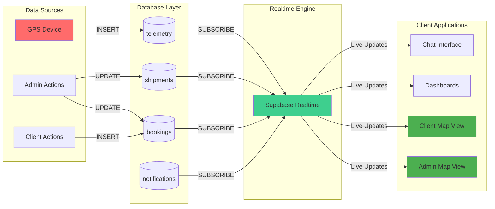
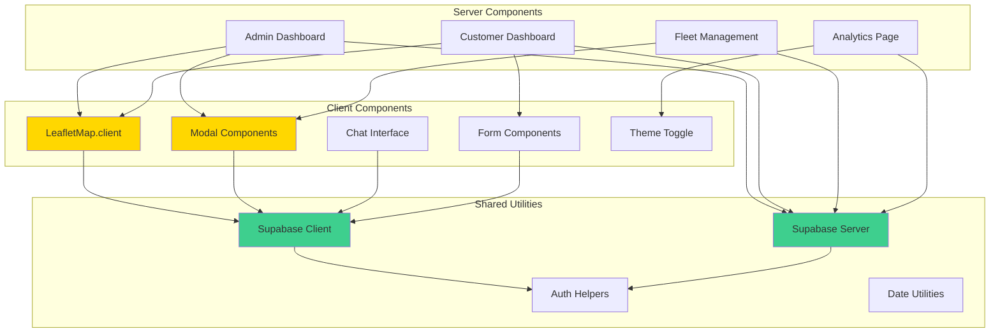

# Rajmohan Transport Services (RTS) 🚛

> **Enterprise-grade transportation management system** built with Next.js 15, TypeScript, and Supabase. Provides role-based workflows, real-time tracking, analytics, and comprehensive fleet management.

---

## 📋 Table of Contents

- [Project Status](#-project-status)
- [Architecture Overview](#-architecture-overview)
- [What's Working](#-whats-working-fully-implemented)
- [What's Not Working](#-whats-not-working-pending-implementation)
- [Quick Start](#-quick-start)
- [Tech Stack](#-tech-stack)
- [Feature Roadmap](#-feature-roadmap)
- [Documentation](#-documentation)
- [Project Structure](#-project-structure)

---

## 🎯 Project Status

**Last Updated:** October 26, 2025  
**Version:** 2.4  
**Status:** ✅ **Production-Ready Core Features** | 🚧 **Advanced Features In Progress**

### Latest Updates (v2.4)
- ✅ **UI/UX Enhancements**: Removed redundant navigation elements from customer dashboard
- ✅ **Document Center Redesign**: Simplified document access with clear call-to-action
- ✅ **Help Resources Optimization**: Reduced from 4 to 3 buttons for cleaner interface
- ✅ **Documentation Organization**: All .md files consolidated in `/Documents` folder
- ✅ **Settings Page Review**: Verified responsive design and dark mode compatibility

---

## 🏗️ Architecture Overview

### System Architecture



### Database Schema Overview



**Key Tables:**
- **profiles**: User accounts with role-based access (admin/client)
- **clients**: Client companies with billing information
- **contracts**: Time-bound agreements between clients and RTS
- **bookings**: Client intake requests (before approval)
- **shipments**: Approved bookings converted to active shipments
- **trucks**: Fleet vehicles with real-time location tracking
- **drivers**: Driver information and credentials
- **telemetry**: Real-time GPS data from trucks
- **notifications**: Multi-channel notification system
- **dispatch_offers**: Driver assignment offers with ranking

**Security:**
- All tables have Row Level Security (RLS) enabled
- Admin access controlled via `public.is_admin(uuid)` function
- Clients can only see their own data (via client_id)
- Policies enforce data isolation between tenants
        text invoice_number UK
        uuid client_id FK
        uuid shipment_id FK
        date issue_date
        date due_date
        numeric total_amount
        text status
        text document_path
    }
    
    driver_documents {
        uuid id PK
        uuid driver_id FK
        text document_type
        text file_path
        date expiry_date
        text status
    }
    
    truck_documents {
        uuid id PK
        text truck_id FK
        text document_type
        text file_path
        date expiry_date
        text status
    }
    
    contract_documents {
        uuid id PK
        uuid contract_id FK
        text document_type
        text file_path
        numeric file_size
    }
    
    notifications {
        uuid id PK
        uuid user_id FK
        text title
        text message
        text type
        boolean read
    }
```

### Authentication & Authorization Flow



### Booking & Document Workflow



### Real-time Data Flow



### Component Architecture



---

## 🆕 Latest Updates (October 2025)

### Recent Enhancements

#### 📁 Document Management System (Oct 26, 2025) ✅
- ✅ **Complete Document Management Module** (`/documents`)
  - Contract documents with client routing
  - Invoice PDFs with automatic invoice records
  - Driver licenses and certifications
  - Truck insurance and registration
  - Miscellaneous documents
- ✅ **Client-Specific Document Routing**
  - Auto-route contracts, invoices, and misc docs to specific clients
  - Client selection dropdown with email display
  - Automatic client notification system
- ✅ **Smart Upload Modal**
  - Dynamic form fields based on document type
  - File validation (10MB limit, PDF/JPG/PNG)
  - Client and entity selectors
  - Date fields (issue/expiry)
  - Description and notes
- ✅ **Notification System**
  - Clients notified when documents uploaded
  - In-app notifications
  - Document type, filename, and metadata
- ✅ **Document Categories**
  - 10 predefined categories with icons
  - Status tracking (Active/Pending/Expired)
  - Expiry date monitoring
  - Document count per category
- ✅ **Storage Organization**
  - 4 Supabase Storage buckets
  - Organized by client/entity folders
  - Secure RLS policies
- ✅ **Document Actions**
  - Download documents
  - View document details
  - Status tracking
  - Search and filter
- ✅ **Full Documentation**
  - `DOCUMENT_MANAGEMENT_GUIDE.md` (500+ lines)
  - `DOCUMENT_ROUTING_IMPROVEMENTS.md` (comprehensive)
  - `IMPLEMENTATION_CHECKLIST.md` (300+ items)
  - Sample data scripts

#### 🎨 Dark Mode Optimization (Oct 26, 2025)
- ✅ Complete dark mode overhaul for Advanced Truck Management page
- ✅ Consistent CSS variable usage across all components
- ✅ Improved contrast ratios for better accessibility
- ✅ Enhanced visibility of dropdowns, tables, and modals in dark mode
- ✅ Smooth theme transitions with proper color inheritance

#### 📁 Documentation Consolidation (Oct 26, 2025)
- ✅ Merged `docs/` and `Documents/` directories into unified `/Documents`
- ✅ Organized 115+ documentation files for easier navigation
- ✅ Added comprehensive mermaid architecture diagrams
- ✅ Updated README with latest system architecture
- ✅ Consolidated all SQL scripts into `/supabase` directory

#### 🚚 Truck Status Management (Oct 25, 2025)
- ✅ Auto-update truck status based on telemetry data
- ✅ Public read access for trucks (guest user showcase)
- ✅ Enhanced truck status history tracking
- ✅ Improved status badge visibility in dark mode

#### 📧 Email System Enhancements (Oct 16, 2025)
- ✅ Professional HTML email templates for drivers and clients
- ✅ Dynamic email routing with accurate trip details
- ✅ Mobile-responsive email design
- ✅ Graceful error handling (non-blocking)
- ✅ Email logging to database for audit trail

#### ⚙️ Settings System (Oct 15, 2025)
- ✅ Comprehensive user settings page
- ✅ Theme customization (light/dark, accent colors)
- ✅ Language selection (English, Hindi, Marathi)
- ✅ Notification preferences (email, SMS, in-app)
- ✅ Profile management with emergency contacts

#### 📊 Analytics & Profit/Loss (Oct 15, 2025)
- ✅ Truck-wise profit/loss analytics
- ✅ Interactive Chart.js visualizations
- ✅ Real-time data refresh every 30 seconds
- ✅ Date range filters with custom presets
- ✅ CSV export functionality

### Migration Notes

If upgrading from earlier versions:

1. **Run Database Migrations**: Execute all migration files in `supabase/migrations/` in chronological order
2. **Update Environment Variables**: Check `.env.local.example` for new required variables
3. **Clear Cache**: Run `bun run build` or `npm run build` to clear Next.js cache
4. **Verify RLS Policies**: Ensure all RLS policies from `schema.sql` are applied
5. **Test Dark Mode**: Toggle theme and verify all pages render correctly
6. **Update Documentation References**: Point to `/Documents` instead of `/docs`

---

## ✅ What's Working (Fully Implemented)

### 🔐 Authentication & Authorization
- ✅ **Supabase Auth Integration**
  - Email/password authentication
  - Role-based access control (Admin/Client)
  - Admin allowlist by domain/email (`NEXT_PUBLIC_ADMIN_EMAIL_DOMAINS`)
  - Profile management with RLS policies
  - Password reset flow
  - Guest mode for browsing
- ✅ **Token Management**
  - Auto-refresh handling
  - Invalid token cleanup
  - Session persistence
  - Auth state listeners

### 👨‍💼 Admin Features

#### 📊 Admin Dashboard (`/admin`)
- ✅ **KPI Cards**
  - Total shipments, revenue, active trucks, idling hours
  - Date range filters (hour/day/month/year)
  - Real-time data updates
- ✅ **Live Fleet Map**
  - Full fleet visibility with Leaflet integration
  - Truck status, speed, location
  - Telemetry data visualization
- ✅ **Booking Management**
  - View pending bookings
  - Approve with truck assignment modal
  - Reject bookings with notifications
  - Trip confirmation with driver details
  - Real-time booking updates
- ✅ **Recent Shipments Table**
  - Origin, destination, status, dates
  - Sortable columns
  - Quick filters

#### 📈 Analytics Dashboard (`/admin/analytics`)
- ✅ **Interactive Charts** (Chart.js)
  - Shipments by status (doughnut)
  - Shipments per month (bar)
  - Trucks by status (doughnut)
  - Distance traveled per month (line)
  - Revenue per month (line)
  - Profit/Loss per truck (horizontal bar)
- ✅ **Performance Summary Cards**
  - Total trucks, profitable trucks
  - Loss-making trucks, fleet efficiency
- ✅ **Real-time Data**
  - Auto-refresh every 30 seconds
  - Live database subscriptions
  - Dark mode support

#### 🚛 Fleet Management (`/admin/fleet`)
- ✅ **Truck Management**
  - Add/edit/delete trucks
  - Display code, plate, status, vehicle type
  - Driver assignment
  - Location tracking
  - Status filters (Running/Halt/Offline/Maintenance)
  - Search functionality
  - Statistics dashboard
- ✅ **Driver Management**
  - Add/edit drivers
  - Link drivers to trucks
  - Phone and email tracking
  - Driver performance metrics
- ✅ **Trip History**
  - View all trips per truck
  - Origin, destination, status
  - Distance, cost, dates
  - Shipment linking
- ✅ **Maintenance Records**
  - Schedule maintenance
  - Track completion
  - Cost tracking (estimated vs actual)
  - Priority levels (Low/Medium/High/Critical)
  - Status tracking
- ✅ **Fuel Records**
  - Log fuel entries
  - Fuel efficiency (km/liter)
  - Cost tracking
  - Receipt numbers
- ✅ **Route Optimization**
  - Pre-calculated routes
  - Optimization strategies (fastest/shortest/economical/balanced)
  - Distance and duration estimates
  - Cost calculations
  - Usage tracking

#### 🚚 Manage Trucks (`/admin/manage-trucks`)
- ✅ **CRUD Operations**
  - Add trucks with display code, plate, status
  - Edit truck details
  - Delete trucks
  - Bulk operations support
- ✅ **Driver Linking**
  - Assign/unassign drivers
  - View driver details inline
  - Driver availability status

#### 📄 Contracts (`/contracts`)
- ✅ **Contract Management**
  - List all contracts
  - Filter by status (Active/Expired/All)
  - Create new contracts (Admin only)
  - Client info, dates, rates, terms
  - Contract linking to shipments
- ✅ **Contract Details**
  - Start/end dates
  - Payment terms, billing cycle
  - Rate per km, total value
  - Routes and vehicle types

#### � Document Management (`/documents`) ✅ NEW
- ✅ **Comprehensive Document System**
  - 10 document categories with icons and colors
  - Category cards showing document count and expiring docs
  - Search and filter documents
  - Status tracking (Active/Pending/Expired)
- ✅ **Document Categories**
  - Contract documents
  - Invoices
  - Driver licenses
  - Truck insurance
  - Truck registration
  - Compliance documents
  - Maintenance records
  - Inspection certificates
  - Permits
  - Miscellaneous
- ✅ **Smart Upload System**
  - Client selection for contracts, invoices, misc docs
  - Entity selection (drivers/trucks) for relevant docs
  - File validation (10MB, PDF/JPG/PNG)
  - Document metadata (number, issue date, expiry date)
  - Description and notes fields
- ✅ **Client Routing & Notifications**
  - Auto-route documents to specific clients
  - Client email displayed in selector
  - Real-time notification creation
  - Success confirmation messages
- ✅ **Document Actions**
  - Download documents
  - View document details
  - Status badges (Active/Expiring/Expired)
  - Entity information display
- ✅ **Storage Integration**
  - 4 Supabase Storage buckets
  - Organized folder structure by client/entity
  - Secure RLS policies for access control
- ✅ **Dark Mode Support**
  - Full CSS variables integration
  - Smooth animations
  - Responsive design

#### �📤 Data Export
- ✅ **CSV Export** (`/admin/export/shipments`)
  - Export shipments by date range
  - All shipment fields included
  - Formatted for Excel/Sheets

#### 💬 Support System
- ✅ **Admin Support Chat** (`/admin/support`)
  - Instagram-style chat interface
  - Real-time messaging
  - Dark mode support
  - Notification badges
  - Message timestamps
  - Auto-scroll

### 👤 Client Features

#### 📊 Client Dashboard (`/dashboard/customer`)
- ✅ **Enhanced Booking Form**
  - Interactive route map with autocomplete
  - Source/destination selection
  - Vehicle type selection (with icons)
  - Material type, weight (MT)
  - Pickup date selector
  - Notes field
  - **Dynamic distance/time calculation** (OSRM API)
  - **Route visualization** with markers
  - Recommended vehicle by weight
  - Cost estimation
- ✅ **My Bookings Section**
  - View recent bookings
  - Status tracking
  - "View All →" link to bookings page
- ✅ **My Shipments Table**
  - Origin, destination, status, ETA, cost
  - Search and filter (All/Pending/In Transit/Delivered)
  - Real-time updates
- ✅ **Live Tracking Map**
  - Package location (limited view)
  - Truck identifier
  - Real-time position updates
- ✅ **Quick Stats**
  - Total shipments, delivered, in transit
- ✅ **FAQ Section**
  - Expandable details
  - Common questions answered
- ✅ **Document Center**
  - Clear, prominent section
  - "View All Documents" call-to-action
  - Direct link to `/documents` page
  - No shipment dependency
  - Works for all clients
  - Gradient button with hover effects
- ✅ **Help Resources**
  - User guide link
  - Contact support button
  - Email support
  - Clean 3-column grid layout
- ✅ **Support Chat**
  - Same as admin chat
  - Connect with admin support
  - Real-time messaging
- ✅ **Issue Reporting**
  - Report issues with shipments
  - Attach details
  - Issue tracking
- ✅ **Dark Mode**
  - 20+ custom animations
  - Full CSS variables support
  - Smooth transitions
  - Persistent preference

#### 📋 Bookings Page (`/bookings`)
- ✅ **Comprehensive Booking View**
  - All past and current bookings
  - Search by ID, source, destination
  - Filter by status (All/Active/Past)
  - Dark mode support
- ✅ **Booking Cards**
  - Route display with colored status badges
  - Booking details (vehicle, weight, pickup date)
  - Created date
  - "View Details" button
- ✅ **Booking Details Modal**
  - Floating overlay window
  - Route visualization (start/end points)
  - Booking information grid
  - Shipment information (if approved)
  - Truck details and ETA
  - Notes display
  - Action buttons (Track on Map, Close)
  - Click-outside-to-close
  - Mobile-responsive
- ✅ **Real-time Updates**
  - Supabase subscriptions
  - Live status changes
  - Notification on approval/rejection

### 🎨 UI/UX Features
- ✅ **Global Theme System**
  - Light/Dark mode toggle
  - Persistent preference (localStorage)
  - CSS variables for easy theming
  - Smooth transitions
- ✅ **Responsive Design**
  - Mobile, tablet, desktop layouts
  - Adaptive navigation
  - Touch-friendly controls
  - Responsive tables and modals
- ✅ **Visual Enhancements**
  - 20+ keyframe animations
  - Gradient backgrounds
  - Glow effects in dark mode
  - Loading states
  - Empty states
  - Error handling
- ✅ **Component Library**
  - Reusable buttons, cards, panels
  - Status badges
  - Modals (Assign Truck, Trip Confirmation, Booking Details)
  - Chat components
  - Map components
  - Form components
- ✅ **Navigation**
  - Top navigation bar
  - User menu dropdown
  - Role-based menu items
  - Guest mode support
  - Theme toggle button
  - Notification badges

### 🗺️ Maps & Tracking
- ✅ **Leaflet Integration**
  - Client-side rendering (no SSR issues)
  - Custom marker icons
  - Popups with truck details
  - Auto-fit bounds
  - India-centered (20.5937, 78.9629)
- ✅ **Admin Map View**
  - Full fleet visibility
  - Truck plate, status, speed
  - Last updated timestamp
  - "More info" details section
- ✅ **Client Map View**
  - Limited to client's shipments
  - Truck identifier only
  - Real-time package location
- ✅ **Route Planning Map** (Booking Form)
  - Address autocomplete (Nominatim API)
  - Source/destination markers
  - Route visualization (OSRM API)
  - Distance and duration display
  - Debounced search
  - Mobile-friendly
- ✅ **Real-time Telemetry**
  - Subscribe to `telemetry` table
  - Live marker updates
  - Speed, status changes
  - No page refresh needed

### 💾 Database & Backend
- ✅ **Supabase Setup**
  - Tables: profiles, clients, contracts, shipments, trucks, drivers, telemetry, bookings, trips, maintenance_records, driver_performance, fuel_records, optimized_routes, user_settings, notification_preferences, system_config, **document_categories, invoices, driver_documents, truck_documents, contract_documents, document_audit_log** 📁 NEW
  - **Storage Buckets**: invoices, driver-documents, truck-documents, contract-documents 📁 NEW
  - RLS policies for all tables
  - Admin helper function: `public.is_admin(uid)`
  - Indexes for performance
  - **Document management functions**: check_expiring_documents(), update_expired_documents(), generate_invoice_number() 📁 NEW
- ✅ **API Routes**
  - `/api/bookings/approve` - Approve booking and create shipment
  - `/api/bookings/reject` - Reject booking with reason
  - `/api/drivers` - Create drivers (admin-only)
  - `/api/admin/export/shipments` - CSV export
- ✅ **Real-time Subscriptions**
  - Bookings changes
  - Telemetry updates
  - Notifications
- ✅ **Row-Level Security**
  - Profiles: self read/update/insert; admin read all
  - Shipments: admin read/write; client read own
  - Bookings: client insert/read own; admin read/update all
  - Trucks, Drivers, Maintenance, Fuel, Routes: admin-only
  - Telemetry: admin write; all read

### 📧 Notifications
- ✅ **Real-time Notifications**
  - Booking approval notifications
  - Booking rejection notifications
  - In-app notification display
  - Supabase Realtime integration
- ✅ **Notification Badges**
  - Chat notification counts
  - Unread message indicators
  - Real-time updates

### � Notifications
- ✅ **Real-time Notifications**
  - Booking approval notifications
  - Booking rejection notifications
  - In-app notification display
  - Supabase Realtime integration
- ✅ **Notification Badges**
  - Chat notification counts
  - Unread message indicators
  - Real-time updates
- ✅ **Email Notification System** (COMPLETED - Oct 16, 2025)
  - Professional HTML email templates
  - Driver trip assignment emails
  - Client booking approval emails
  - Client trip started emails
  - Client trip completed emails
  - SMTP integration with nodemailer
  - Accurate trip data with `analyzeTripDetails()`
  - Distance, time, cost calculations
  - Driver contact information
  - Route visualization in emails
  - Graceful error handling (non-blocking)
  - Email logging to database
  - Plain text fallback
  - Mobile-responsive email design

### �🔧 Settings
- ✅ **User Settings Page** (`/settings`)
  - Profile settings (phone, company, emergency contact)
  - Appearance (theme, accent color, font size, view density)
  - Language & Region (en/hi/mr, date format, timezone)
  - Notification preferences (email, SMS, in-app)
  - Password change
  - Data export

---

## ❌ What's Not Working (Pending Implementation)

### 🚧 In Progress

#### 🔔 Advanced Notifications
- ⏳ **SMS Notifications**
  - OTP verification
  - Critical alerts
  - *Status:* Third-party integration pending (Twilio/AWS SNS)

#### 🧮 Advanced Analytics
- ⏳ **Custom Reports**
  - Date range filters with presets
  - Export to PDF/Excel
  - Scheduled report generation
  - *Status:* UI 50% complete
- ⏳ **Financial Reports**
  - Profit margins per client
  - Operating cost breakdowns
  - Fuel efficiency trends
  - *Status:* Database functions ready

#### 🗺️ Route Intelligence
- ⏳ **ETA Prediction**
  - Real routing service integration (Mapbox/Google)
  - Traffic consideration
  - Weather impact
  - *Status:* API integration pending
- ⏳ **Cost Optimization**
  - Toll calculation
  - Fuel-efficient routes
  - Multi-stop optimization
  - *Status:* Algorithm design phase

### 🔴 Not Started

#### 📦 Client Intake Flow
- ❌ **Vehicle Recommendation System**
  - Weight-based suggestions
  - Capacity validation
  - Lane availability check
  - *Priority:* Medium

#### 📊 Advanced Truck Status
- ❌ **Rich Status Model**
  - Running/Halt/Maintenance/Offline states
  - Bulk status updates
  - Status history tracking
  - *Priority:* Medium

#### 💰 Payment Integration
- ❌ **Payment Gateway**
  - Razorpay/Stripe integration
  - Invoice generation
  - Payment tracking
  - *Priority:* High (Q1 2026)

#### 📱 Mobile App
- ❌ **Driver Mobile App**
  - Trip acceptance
  - GPS tracking
  - Document scanning
  - *Priority:* High (Q2 2026)
- ❌ **Client Mobile App**
  - Booking on-the-go
  - Real-time tracking
  - Push notifications
  - *Priority:* Medium (Q3 2026)

#### 🤖 Automation
- ❌ **Auto-Assignment**
  - AI-based truck assignment
  - Load optimization
  - Driver availability matching
  - *Priority:* Low (Future)

#### 📈 Business Intelligence
- ❌ **Predictive Analytics**
  - Demand forecasting
  - Maintenance prediction
  - Cost trend analysis
  - *Priority:* Low (Future)

---

## Quick start

1) Configure env

- Copy `.env.local.example` to `.env.local` and fill:
  - `NEXT_PUBLIC_SUPABASE_URL`
  - `NEXT_PUBLIC_SUPABASE_ANON_KEY`
  - `NEXT_PUBLIC_ADMIN_EMAIL_DOMAINS` (comma-separated domains)
  - `NEXT_PUBLIC_ADMIN_EMAILS` (comma-separated emails)

2) Install and run

```bash
npm install
npm run dev
```

Alternatively, using Bun:

```bash
bun install
bun run dev
```

The dev server runs on port 3000 when available.

## Supabase setup

1) Create a project on Supabase and get the URL + anon key
2) Apply schema: open Supabase SQL editor and run `supabase/schema.sql`
3) **Apply document management migration** 📁 NEW: Run `supabase/migrations/2025-10-26-document-management-system.sql` in SQL editor
4) **Create storage buckets** 📁 NEW: In Supabase Dashboard → Storage, create 4 buckets:
   - `invoices` (Private, 10MB limit)
   - `driver-documents` (Private, 10MB limit)
   - `truck-documents` (Private, 10MB limit)
   - `contract-documents` (Private, 10MB limit)
5) Seed minimal data
- Insert a `clients` row
- Create a user (Auth) → insert into `profiles` with id = auth user id, role = 'admin' or 'client', and optional client_id for clients
- Optional: insert trucks, drivers; set `trucks.driver_id` for linking
- Optional: Run `supabase/SAMPLE_DATA.sql` for test data

Tables of interest (high-level)

- profiles(id, role, name, email, client_id)
- clients(id, name, ...)
- contracts(id, client_id, start_at, end_at, ...)
- shipments(id, client_id, contract_id, truck_id, origin, destination, status, eta, cost, created_at)
- trucks(id, plate, status, location, driver_id, ...)
- drivers(id, name, phone, license, ...)
- telemetry(id, truck_id, ts, lat, lng, speed, status)
- bookings(id, user_id, client_id, vehicle_type, source_city, destination_city, weight_mt, pickup_date, status)
- **document_categories**(id, name, description, icon, color) 📁 NEW
- **invoices**(id, invoice_number, client_id, shipment_id, document_path, status) 📁 NEW
- **driver_documents**(id, driver_id, document_type, file_path, expiry_date, status) 📁 NEW
- **truck_documents**(id, truck_id, document_type, file_path, expiry_date, status) 📁 NEW
- **contract_documents**(id, contract_id, file_path, uploaded_by) 📁 NEW
- **document_audit_log**(id, document_table, document_id, action, user_id) 📁 NEW

RLS summary (admin highlights)

- Profiles: self read/update/insert; admin read via public.is_admin()
- Clients/Contracts/Shipments/Trucks/Telemetry: admin read; shipments admin insert
- Bookings: client insert/select; admin read/update
- **Documents** 📁 NEW: admin full access; clients read own via client_id
- Drivers: admin read

## Core routes and workflows

Auth and role routing

- `/login`, `/register`: Supabase auth with admin allowlist
- Role bootstrap → route admin → `/admin`, client → `/dashboard/customer`

Admin dashboard `/admin`

- Guarded SSR; shows KPIs, map, recent shipments, bookings table
- Approve opens Assign Truck modal: pick a truck (with driver details) and submit
- Reject marks booking rejected

Analytics `/admin/analytics`

- Server-side metrics with client charts

Manage Trucks `/manage-trucks`

- Add/remove trucks persisted in Supabase (id, plate, status, location)

Admin link Drivers ↔ Trucks `/admin/manage-trucks`

- Admin-only SSR page to assign `trucks.driver_id`

Contracts `/contracts`

- Browse and filter contracts client-side

Exports `/admin/export/shipments`

- CSV export for shipments by date range

Route stability and redirects
- app/* shims re-export src/app/* pages to keep `/admin`, `/admin/analytics`, `/manage-trucks` stable
- Middleware normalizes legacy paths (`/manage-truck`, `/admin/manage-truck`, `/admin/manage-trucks`) → `/manage-trucks`
- `/admin-analytics` redirects → `/admin/analytics`

## Maps and realtime

Leaflet client component: `src/components/map/LeafletMap.client.tsx`
- Admin sees full fleet and telemetry detail
- Client sees only limited information linked to their shipments

Realtime: insert into `telemetry(truck_id, ts, lat, lng, speed, status)` → UI subscribes and updates markers

GPS ingestion: small adapter process writes to telemetry; `trucks` and `shipments` link data to the map

## UI and responsiveness

- Global styles in `src/app/globals.css` with responsive table and modal patterns
- Assign Truck modal is scrollable, resizes with viewport, and hides non-essential columns on small screens
- Top nav for admin hides “Home”; the brand links home
 - Modal trigger pattern: the Approve button dispatches a window event handled by `src/components/admin/OpenAssignTruckModalListener.client.tsx`, which mounts the modal outside the table via a portal

## Troubleshooting

- Missing names/emails in admin bookings table: ensure `profiles.name` or `profiles.email` exists for the user; the UI prefers name ⇒ email ⇒ short id
- 404 for `/admin/analytics` or `/manage-trucks`: confirm top-level shims exist under `app/admin/analytics` and `app/manage-trucks`
- RLS blocks admin actions: verify `public.is_admin(uid)` function and admin policies are applied from `schema.sql`
- Map not rendering: check Leaflet CSS link in `src/app/layout.tsx` and env configuration

- TypeError: useState only works in Client Components
  - Cause: A React hook was used inside a Server Component file.
  - Fix: Move hook-using logic into a `.client.tsx` component and import it from the server page. This repo uses `src/components/admin/OpenAssignTruckModalListener.client.tsx` and imports it in `src/app/admin/page.tsx`.

- Hydration error: “div inside tbody” when opening the modal from a table row
  - Cause: Rendering a modal container within a `<tbody>` breaks DOM invariants.
  - Fix: Render the modal via a portal appended to `document.body`. See `src/components/admin/AssignTruckModal.client.tsx` for the portal pattern.

- Supabase error: column "location" of relation "trucks" does not exist
  - Cause: The database did not yet have the `trucks.location` column.
  - Fix: Apply `supabase/schema.sql` which includes `ALTER TABLE trucks ADD COLUMN IF NOT EXISTS location text;` and re-run the app.

## Roadmap (near-term)

- Driver records UI (off-nav) with create/edit; optional documents upload
- Rich truck status model (running, halt, maintenance, offline), filters and bulk actions
- ETA from routing service (Mapbox/OSRM/Google) and cost estimation
- Client intake: vehicle recommendation by weight and lane


## 🚀 Quick Start

### Prerequisites
- **Node.js** 18+ or **Bun** runtime
- **Supabase** account (free tier works)
- **Git** for cloning

### 1. Clone & Install

```bash
git clone <your-repo-url>
cd RTS-website
npm install  # or bun install
```

### 2. Environment Setup

Create `.env.local` in the project root:

```env
# Supabase
NEXT_PUBLIC_SUPABASE_URL=https://xxxxxxxxxxxxx.supabase.co
NEXT_PUBLIC_SUPABASE_ANON_KEY=your_anon_key_here

# Admin Allowlist (comma-separated)
NEXT_PUBLIC_ADMIN_EMAIL_DOMAINS=rajmohantransport.com,admin.rts.in
NEXT_PUBLIC_ADMIN_EMAILS=admin@example.com,ceo@example.com

# SMTP Email Configuration (for driver and client notifications)
SMTP_HOST=smtp.gmail.com
SMTP_PORT=587
SMTP_SECURE=false
SMTP_USER=your-email@gmail.com
SMTP_PASS=your-app-password
SMTP_FROM_NAME=Rajmohan Transport Services
SMTP_FROM_EMAIL=notifications@rajmohantransport.com

# Optional: Third-party APIs
NEXT_PUBLIC_MAPBOX_TOKEN=your_mapbox_token_here
```

> **📧 Email Setup Note**: For email notifications to work, you need to configure SMTP credentials. For Gmail:
> 1. Enable 2-factor authentication on your Google account
> 2. Generate an "App Password" at https://myaccount.google.com/apppasswords
> 3. Use the app password (not your regular password) in `SMTP_PASS`
> 4. Emails will be sent to drivers when bookings are approved and to clients for trip updates

### 3. Supabase Database Setup

1. **Create Tables**:
   ```bash
   # Run schema.sql in Supabase SQL Editor
   cat supabase/schema.sql
   # Copy contents to SQL Editor → Run
   ```

2. **Seed Data** (optional):
   ```bash
   # Run seed.sql for sample data
   cat supabase/seed.sql
   ```

3. **Enable Realtime**:
   - Go to Database → Replication
   - Enable for: `bookings`, `telemetry`, `notifications`

### 4. Run Development Server

```bash
npm run dev
# Opens on http://localhost:3000
```

### 5. Login/Register

- **Admin**: Use email with domain from `NEXT_PUBLIC_ADMIN_EMAIL_DOMAINS`
- **Client**: Any valid email
- **Guest**: Click "Continue as Guest" (limited access)

---

## 🛠️ Tech Stack

### Frontend
- **Next.js 15** - App Router, Server/Client Components, TypeScript
- **React 18** - Hooks (useState, useEffect, useCallback, useRef)
- **CSS** - Modules, custom properties (CSS variables), dark mode
- **Leaflet.js** - Interactive maps
- **Chart.js** - Analytics charts (doughnut, bar, line)

### Backend
- **Supabase** - Authentication, PostgreSQL, Row-Level Security, Realtime
- **Next.js API Routes** - Server-side logic (`/api/*`)
- **PostgreSQL** - 15+ tables with RLS policies

### External Services
- **OpenStreetMap** - Base map tiles
- **Nominatim API** - Address autocomplete (geocoding)
- **OSRM API** - Route calculation, distance/time estimation

### Dev Tools
- **TypeScript** - Type safety
- **ESLint** - Code linting
- **Turbopack** - Fast dev bundler (Next.js 15)

---

## 📁 Architecture

### System Architecture Overview

```mermaid
graph TB
    subgraph "Client Layer"
        Browser[Web Browser]
        Mobile[Mobile Browser]
    end

    subgraph "Next.js 15 App Router"
        subgraph "Public Routes"
            Login[Login Page]
            Register[Register Page]
            ForgotPW[Forgot Password]
        end

        subgraph "Admin Routes"
            AdminDash[Admin Dashboard<br/>KPIs, Map, Bookings]
            Analytics[Analytics<br/>Charts & Reports]
            Fleet[Fleet Management<br/>Trucks, Drivers, Trips]
            ManageTrucks[Manage Trucks<br/>CRUD Operations]
            AdminSupport[Support Chat]
            ExportAPI[CSV Export API]
        end

        subgraph "Client Routes"
            ClientDash[Client Dashboard<br/>Bookings, Shipments]
            BookingsPage[Bookings Page<br/>Search, Filter, Modal]
            Contracts[Contracts List]
        end

        subgraph "Shared Routes"
            Settings[Settings Page]
            SharedContracts[Contracts View]
        end

        subgraph "API Routes"
            BookingApprove["POST /api/bookings/approve"]
            BookingReject["POST /api/bookings/reject"]
            ShipmentStart["POST /api/shipments/:id/start"]
            ShipmentEnd["POST /api/shipments/:id/end"]
            ExportShipments["GET /api/admin/export/shipments"]
        end

        subgraph "Components"
            LeafletMap[LeafletMap.client<br/>Real-time GPS]
            AdminAnalytics[AdminAnalytics.client<br/>Chart.js Charts]
            BookingModal[Booking Details Modal]
            AssignTruckModal[Assign Truck Modal]
            ChatComponent[Instagram Chat]
        end
    end

    subgraph "Supabase Backend"
        subgraph "Authentication"
            SupaAuth[Supabase Auth<br/>Email/Password, JWT]
            RLS[Row Level Security<br/>is_admin helper]
        end

        subgraph "PostgreSQL Database"
            ProfilesTable[(profiles<br/>role, client_id)]
            BookingsTable[(bookings<br/>status, user_id)]
            ShipmentsTable[(shipments<br/>truck_id, status)]
            TrucksTable[(trucks<br/>driver_id, location)]
            DriversTable[(drivers<br/>name, email, phone)]
            TelemetryTable[(telemetry<br/>lat, lng, speed)]
            ContractsTable[(contracts<br/>client_id, rates)]
            TripsTable[(trips<br/>distance, cost)]
            MaintenanceTable[(maintenance_records)]
            FuelTable[(fuel_records)]
            RoutesTable[(optimized_routes<br/>waypoints JSONB)]
            NotificationsTable[(notifications<br/>type, read)]
            SettingsTable[(user_settings<br/>theme, language)]
        end

        subgraph "Realtime"
            RealtimeBookings[Bookings Channel]
            RealtimeTelemetry[Telemetry Channel]
            RealtimeNotif[Notifications Channel]
        end
    end

    subgraph "External Services"
        OSM[OpenStreetMap<br/>Map Tiles]
        Nominatim[Nominatim API<br/>Geocoding]
        OSRM[OSRM API<br/>Routing & Distance]
        SMTP[SMTP Server<br/>nodemailer]
    end

    subgraph "Email System"
        EmailTemplates[HTML Email Templates<br/>Driver & Client]
        EmailService[Email Service<br/>analyzeTripDetails]
    end

    %% Client to Next.js
    Browser --> Login
    Browser --> AdminDash
    Browser --> ClientDash
    Mobile --> ClientDash

    %% Authentication Flow
    Login --> SupaAuth
    Register --> SupaAuth
    SupaAuth --> ProfilesTable
    SupaAuth --> RLS

    %% Admin Routes to Components
    AdminDash --> LeafletMap
    AdminDash --> AssignTruckModal
    Analytics --> AdminAnalytics
    Fleet --> ManageTrucks

    %% Client Routes to Components
    ClientDash --> LeafletMap
    ClientDash --> ChatComponent
    BookingsPage --> BookingModal

    %% API to Database
    BookingApprove --> BookingsTable
    BookingApprove --> ShipmentsTable
    BookingApprove --> EmailService
    BookingReject --> BookingsTable
    ShipmentStart --> ShipmentsTable
    ShipmentStart --> EmailService
    ShipmentEnd --> ShipmentsTable
    ShipmentEnd --> EmailService

    %% Email System
    EmailService --> EmailTemplates
    EmailTemplates --> SMTP

    %% Components to Database
    LeafletMap --> TelemetryTable
    LeafletMap --> TrucksTable
    AssignTruckModal --> TrucksTable
    AssignTruckModal --> DriversTable
    AdminAnalytics --> ShipmentsTable
    AdminAnalytics --> TrucksTable
    AdminAnalytics --> TripsTable

    %% Realtime Subscriptions
    RealtimeBookings -.->|Live Updates| BookingsPage
    RealtimeBookings -.->|Live Updates| AdminDash
    RealtimeTelemetry -.->|Live Updates| LeafletMap
    RealtimeNotif -.->|Live Updates| ChatComponent

    %% External Services
    LeafletMap --> OSM
    ClientDash --> Nominatim
    ClientDash --> OSRM
    EmailService --> SMTP

    %% RLS Protection
    RLS -.->|Protect| BookingsTable
    RLS -.->|Protect| ShipmentsTable
    RLS -.->|Protect| TrucksTable
    RLS -.->|Protect| ContractsTable

    %% Styling
    classDef adminClass fill:#ff9800,stroke:#e65100,color:#000
    classDef clientClass fill:#4caf50,stroke:#2e7d32,color:#fff
    classDef dbClass fill:#2196f3,stroke:#0d47a1,color:#fff
    classDef externalClass fill:#9c27b0,stroke:#4a148c,color:#fff
    classDef realtimeClass fill:#00bcd4,stroke:#006064,color:#000

    class AdminDash,Analytics,Fleet,ManageTrucks,AdminSupport,ExportAPI adminClass
    class ClientDash,BookingsPage,Contracts clientClass
    class ProfilesTable,BookingsTable,ShipmentsTable,TrucksTable,DriversTable,TelemetryTable,ContractsTable,TripsTable,MaintenanceTable,FuelTable,RoutesTable,NotificationsTable,SettingsTable dbClass
    class OSM,Nominatim,OSRM,SMTP externalClass
    class RealtimeBookings,RealtimeTelemetry,RealtimeNotif realtimeClass
```



### Project Structure

```
/RTS-website
├── src/                      # Main application source (canonical)
│   ├── app/                  # Next.js App Router (all routes run from here)
│   │   ├── _*.client.tsx     # Global client components (effects, nav, topbar)
│   │   ├── globals.css       # Global styles + CSS variables for theming
│   │   ├── layout.tsx        # Root layout with Leaflet CSS
│   │   ├── page.tsx          # Landing/login redirect
│   │   │
│   │   ├── admin/            # Admin-only routes (SSR protected)
│   │   │   ├── page.tsx      # Admin dashboard (KPIs, map, bookings)
│   │   │   ├── admin.css     # Admin dashboard styles
│   │   │   ├── analytics/    # Analytics dashboard
│   │   │   │   ├── page.tsx  # Charts, metrics, export
│   │   │   │   └── analytics.css
│   │   │   ├── fleet/        # Fleet management
│   │   │   │   ├── page.tsx  # Trucks, drivers, trips, maintenance
│   │   │   │   └── fleet.css
│   │   │   ├── manage-trucks/ # Advanced truck management
│   │   │   │   ├── page.tsx  # CRUD operations, driver assignment
│   │   │   │   └── manage-trucks.css
│   │   │   ├── support/      # Admin support chat
│   │   │   │   ├── page.tsx
│   │   │   │   └── support.css
│   │   │   └── export/       # Export functionality
│   │   │       └── shipments/
│   │   │           └── route.ts  # CSV export API
│   │   │
│   │   ├── api/              # API routes
│   │   │   ├── bookings/
│   │   │   │   ├── approve/
│   │   │   │   │   └── route.ts  # Approve booking
│   │   │   │   └── reject/
│   │   │   │       └── route.ts  # Reject booking
│   │   │   ├── shipments/
│   │   │   │   └── [id]/
│   │   │   │       ├── start/
│   │   │   │       │   └── route.ts  # Start shipment
│   │   │   │       └── end/
│   │   │   │           └── route.ts  # End shipment
│   │   │   └── drivers/
│   │   │       └── route.ts      # Create driver
│   │   │
│   │   ├── bookings/         # Client bookings page
│   │   │   ├── page.tsx      # View all bookings, search, filter
│   │   │   └── bookings.css
│   │   │
│   │   ├── contracts/        # Contracts listing
│   │   │   ├── page.tsx      # Active/Expired contracts
│   │   │   └── contracts.css
│   │   │
│   │   ├── documents/        # 📁 NEW: Document management
│   │   │   ├── page.tsx      # Document categories, upload, download
│   │   │   └── documents.css # Document styling with dark mode
│   │   │
│   │   ├── dashboard/
│   │   │   └── customer/     # Client dashboard
│   │   │       ├── page.tsx  # Booking form, shipments, map
│   │   │       └── customer.css
│   │   │
│   │   ├── forgot-password/  # Password reset flow
│   │   │   └── page.tsx
│   │   │
│   │   ├── login/            # Login page
│   │   │   ├── page.tsx
│   │   │   └── login.css
│   │   │
│   │   ├── register/         # User registration
│   │   │   ├── page.tsx
│   │   │   └── register.css
│   │   │
│   │   ├── settings/         # User settings
│   │   │   ├── page.tsx      # Profile, theme, notifications
│   │   │   └── settings.css
│   │   │
│   │   └── user-guide/       # User documentation
│   │       ├── page.tsx
│   │       └── user-guide.css
│   │
│   ├── components/           # Reusable React components
│   │   ├── admin/
│   │   │   ├── AdminAnalytics.client.tsx       # Chart.js analytics
│   │   │   ├── AssignTruckModal.client.tsx     # Assign truck modal
│   │   │   ├── BookingActionRow.client.tsx     # Booking actions
│   │   │   ├── OpenAssignTruckModalListener.client.tsx
│   │   │   └── TripConfirmationModal.client.tsx
│   │   ├── map/
│   │   │   └── LeafletMap.client.tsx           # Leaflet map component
│   │   └── chat/
│   │       └── ChatInterface.client.tsx        # Instagram-style chat
│   │
│   ├── config/               # Configuration files
│   │   └── supabase.ts       # Supabase configuration
│   │
│   ├── types/                # TypeScript type definitions
│   │   └── global.d.ts       # Global types
│   │
│   ├── utils/                # Utility functions
│   │   └── supabase/
│   │       ├── client.ts     # Client-side Supabase instance
│   │       └── server.ts     # Server-side Supabase instance
│   │
│   ├── middleware.ts         # Next.js middleware (auth, redirects)
│   │
│   └── Dasboard/             # Legacy static HTML (kept for reference)
│       └── customer.html     # Original customer dashboard prototype
│
├── supabase/                 # Database & migrations
│   ├── schema.sql            # Complete database schema (idempotent)
│   ├── seed.sql              # Sample seed data
│   ├── storage-setup.sql     # Storage bucket setup
│   ├── debug-drivers-table.sql
│   ├── verify-fleet-setup.sql
│   ├── RUN_THIS_IN_SUPABASE.sql  # Initial setup script
│   ├── CHECK_TEJAS_SALARY.sql    # Salary verification
│   └── migrations/           # Database migrations
│       ├── 2025-01-15-add-driver-salary-fields.sql
│       ├── 2025-01-16-add-booking-route-data.sql
│       ├── 2025-10-12-chat-system.sql
│       ├── 2025-10-12-fleet-management-features.sql
│       ├── 2025-10-14-add-settings-tables.sql
│       ├── 2025-10-15-truck-profit-loss-analytics.sql
│       ├── 2025-10-25-auto-update-truck-status.sql
│       └── ... (25+ migration files)
│
├── Documents/                # Comprehensive documentation (115+ files)
│   ├── BOOKINGS_IMPLEMENTATION.md
│   ├── CHAT_FEATURE_DOCUMENTATION.md
│   ├── EMAIL_NOTIFICATION_SYSTEM.md
│   ├── FLEET_MANAGEMENT_FEATURES.md
│   ├── DARK_MODE_TRUCK_MANAGEMENT.md
│   ├── TRUCK_STATUS_MANAGEMENT.md
│   ├── SETTINGS_DOCUMENTATION.md
│   ├── GUEST_USER_TRUCKS_SHOWCASE.md
│   └── ... (110+ more documentation files)
│
├── scripts/                  # Utility scripts
│
├── utils/                    # Top-level utilities
│
├── .env.local.example        # Environment variables template
├── .env.local                # Local environment (git-ignored)
├── .github/
│   └── copilot-instructions.md  # AI coding instructions
├── next.config.mjs           # Next.js configuration
├── tsconfig.json             # TypeScript configuration
├── package.json              # Dependencies and scripts
├── bun.lock                  # Bun lockfile
└── README.md                 # This file

Key Features:
- ✅ Server Components (SSR) by default for better performance
- ✅ Client Components (.client.tsx) only where needed (state, effects)
- ✅ All routes run from src/app/ (Next.js natively supports src/ directory)
- ✅ Centralized styles in src/app/globals.css
- ✅ Type-safe with TypeScript
- ✅ RLS-protected Supabase backend
- ✅ Real-time subscriptions for live updates
- ✅ Comprehensive documentation in Documents/
- ✅ All SQL scripts consolidated in supabase/
```

### Core Routes & Workflows

#### Public Routes
- `/` - Landing page → redirects to `/login` or `/dashboard/customer` if authenticated
- `/login` - Email/password login with role selection (admin/client)
- `/register` - Signup with profile creation
- `/forgot-password` - Password reset flow

#### Admin Routes (requires `profiles.role = 'admin'`)
- `/admin` - Main dashboard with KPIs, map, bookings, shipments
- `/admin/analytics` - Charts and performance metrics
- `/admin/fleet` - Fleet management (trucks, drivers, trips, maintenance, fuel, routes)
- `/admin/manage-trucks` - Quick truck CRUD interface
- `/admin/support` - Support chat with clients
- `/admin/export/shipments` - CSV export API
- `/documents` - Document management system 📁 NEW

#### Client Routes (requires `profiles.role = 'client'`)
- `/dashboard/customer` - Client dashboard with bookings, shipments, map, chat
- `/bookings` - All bookings with search, filter, modal details
- `/contracts` - Contracts list with filters
- `/documents` - Access assigned documents 📁 NEW

#### Shared Routes
- `/settings` - User settings (profile, appearance, notifications)
- `/contracts` - Contracts list (admin sees all, client sees own)

### Database Schema

#### Core Tables
- **profiles** - User profiles (id, role, client_id, phone, company, emergency_contact)
- **clients** - Client organizations (id, name, contact_person, address, gstn)
- **users** - Supabase auth.users table (managed by Supabase)

#### Logistics Tables
- **bookings** - Client booking requests (id, user_id, client_id, vehicle_type, source_city, destination_city, material, weight_mt, pickup_date, notes, status, created_at)
- **shipments** - Approved bookings converted to shipments (id, booking_id, truck_id, contract_id, origin, destination, status, eta, cost, distance_km, delivered_at)
- **contracts** - Client contracts (id, client_id, start_date, end_date, rate_per_km, total_value, payment_terms)

#### Fleet Tables
- **trucks** - Fleet vehicles (id, display_code, plate_number, vehicle_type, status, driver_id, location)
- **drivers** - Drivers (id, name, phone, email, license_number, status)
- **telemetry** - Real-time GPS data (truck_id, ts, lat, lng, speed, status)
- **trips** - Trip records (id, truck_id, shipment_id, driver_id, origin, destination, status, distance_km, start_time, end_time, cost)
- **maintenance_records** - Maintenance logs (id, truck_id, type, scheduled_date, completion_date, cost_estimated, cost_actual, priority, status)
- **fuel_records** - Fuel logs (id, truck_id, trip_id, date, liters, cost, odometer_reading, location, receipt_number, efficiency_km_per_liter)
- **driver_performance** - Performance metrics (id, driver_id, trip_id, rating, on_time_delivery, fuel_efficiency, safety_score, feedback)
- **optimized_routes** - Pre-calculated routes (id, source_city, destination_city, waypoints JSONB, distance_km, duration_hours, optimization_strategy, cost_estimate, alternative_routes JSONB)

#### System Tables
- **notifications** - In-app notifications (id, user_id, title, message, type, read, created_at)
- **user_settings** - User preferences (user_id, theme, language, notification_prefs JSONB)
- **notification_preferences** - Notification channels (user_id, email_enabled, sms_enabled, push_enabled)
- **system_config** - System-wide config (key, value JSONB)

#### Document Management Tables 📁 NEW
- **document_categories** - Document types (id, name, description, icon, color, requires_approval)
- **invoices** - Invoice records (id, invoice_number, client_id, shipment_id, issue_date, due_date, subtotal, tax_amount, total_amount, paid_amount, status, document_path, line_items JSONB)
- **driver_documents** - Driver docs (id, driver_id, document_type, document_number, file_name, file_path, file_size, file_type, issue_date, expiry_date, status, is_verified)
- **truck_documents** - Truck docs (id, truck_id, document_type, document_number, file_name, file_path, file_size, file_type, issue_date, expiry_date, status, insurance_provider, insurance_policy_number, insurance_amount)
- **contract_documents** - Contract docs (id, contract_id, file_name, file_path, file_size, file_type, document_type, uploaded_by)
- **document_audit_log** - Audit trail (id, document_table, document_id, action, user_id, user_role, ip_address, metadata JSONB, created_at)

#### Storage Buckets 📁 NEW
- **invoices** - Invoice PDFs (private, 10MB limit, PDF/JPG/PNG)
- **driver-documents** - Driver licenses and certificates (private, 10MB limit)
- **truck-documents** - Truck insurance, registration, permits (private, 10MB limit)
- **contract-documents** - Contract files and miscellaneous docs (private, 10MB limit)

#### RLS Policies
- **Admin Helper**: `public.is_admin(uid UUID)` returns `TRUE` if user's profile has role='admin'
- **Profiles**: Self read/update/insert; admin read all
- **Shipments**: Admin read/write; client read own (via client_id)
- **Bookings**: Client insert/read own; admin read/update all
- **Trucks, Drivers, Maintenance, Fuel, Routes**: Admin-only
- **Telemetry**: Admin write; all read (for map)
- **Contracts**: Admin read/write; client read own
- **Notifications**: Self read/write; admin can write to any user
- **Documents** 📁 NEW: 
  - **Invoices**: Admin full access; clients read own (via client_id)
  - **Driver Documents**: Admin full access
  - **Truck Documents**: Admin full access
  - **Contract Documents**: Admin full access
  - **Storage Buckets**: Admin upload; authorized users download based on ownership

### Real-time Subscriptions

#### Bookings
```typescript
const channel = supabase
  .channel('bookings-changes')
  .on('postgres_changes', {
    event: '*',
    schema: 'public',
    table: 'bookings',
    filter: `user_id=eq.${userId}`
  }, (payload) => {
    console.log('Booking changed:', payload);
    loadBookings(); // Refresh data
  })
  .subscribe();
```

#### Telemetry (Live Map)
```typescript
const channel = supabase
  .channel('telemetry-updates')
  .on('postgres_changes', {
    event: 'INSERT',
    schema: 'public',
    table: 'telemetry'
  }, (payload) => {
    updateMarkerPosition(payload.new);
  })
  .subscribe();
```

#### Notifications
```typescript
const channel = supabase
  .channel('notifications')
  .on('postgres_changes', {
    event: 'INSERT',
    schema: 'public',
    table: 'notifications',
    filter: `user_id=eq.${userId}`
  }, (payload) => {
    showNotification(payload.new);
  })
  .subscribe();
```

---

## 🗺️ Feature Roadmap

### ✅ Phase 1: Core Platform (Completed - Oct 2025)
- [x] Authentication with role-based access
- [x] Admin dashboard with KPIs
- [x] Client dashboard with bookings
- [x] Bookings management (create, approve, reject)
- [x] Fleet management (trucks, drivers)
- [x] Contracts module
- [x] Basic analytics dashboard
- [x] Live fleet map with Leaflet
- [x] Dark mode throughout
- [x] Real-time updates

### 🚧 Phase 2: Enhanced Features (In Progress - Nov-Dec 2025)
- [x] Bookings page with modal details (Oct 2025)
- [x] Chat system (Instagram-style)
- [x] Fleet management expansion (trips, maintenance, fuel)
- [x] Route optimization module
- [x] Profit/loss analytics per truck
- [x] Email notifications (Oct 16-17, 2025) ✅
  - [x] Driver trip assignment emails
  - [x] Client booking approval emails
  - [x] Client trip started emails
  - [x] Client trip completed emails
  - [x] Professional HTML templates
  - [x] SMTP integration
- [x] Settings page with user preferences (Oct 2025)
- [x] **Document Management System** (Oct 26, 2025) ✅
  - [x] Complete document upload/download system
  - [x] Client-specific document routing
  - [x] 10 document categories with icons
  - [x] Automatic client notifications
  - [x] Storage buckets with RLS policies
  - [x] Document expiry tracking
  - [x] Search and filter functionality
- [ ] Advanced analytics reports with PDF export
- [ ] ETA prediction with routing service integration

### 📋 Phase 3: Business Intelligence (Q1 2026)
- [ ] Payment gateway integration (Razorpay/Stripe)
- [ ] Automated invoicing
- [ ] Custom report builder with PDF export
- [ ] Financial analytics (margins, cost breakdowns)
- [ ] Fuel efficiency trends
- [ ] Vehicle recommendation engine
- [ ] Toll calculation and route optimization
- [ ] Multi-stop route optimization

### 🚀 Phase 4: Automation & Mobile (Q2-Q3 2026)
- [ ] Driver mobile app (React Native/Flutter)
  - Trip acceptance
  - GPS tracking
  - Document scanning
  - Real-time communication
- [ ] Client mobile app
  - Booking on-the-go
  - Real-time tracking
  - Push notifications
- [ ] AI-based truck auto-assignment
- [ ] Load optimization algorithms
- [ ] Predictive maintenance alerts

### 🌟 Phase 5: Advanced Intelligence (Q4 2026+)
- [ ] Demand forecasting
- [ ] Cost trend analysis
- [ ] Driver performance AI scoring
- [ ] Route learning from historical data
- [ ] Customer portal with self-service
- [ ] Multi-language support (Hindi, Marathi expansion)
- [ ] Voice commands for drivers
- [ ] IoT sensor integration (temperature, load sensors)

---

## 📚 Documentation

### Comprehensive Documentation (115+ files in `/Documents`)

All documentation has been consolidated into the `/Documents` directory for easier navigation and maintenance.

#### 📖 Implementation Guides
- **`AUTHENTICATION_FLOW_EXPLAINED.md`** - Complete auth & authorization documentation 🔐 NEW (v2.4)
- `BOOKINGS_IMPLEMENTATION.md` - Bookings page features, testing, troubleshooting
- `FLEET_SETUP_GUIDE.md` - Fleet management setup steps
- `ROUTE_BOOKING_README.md` - Route booking with map integration
- `USER_GUIDE_IMPLEMENTATION.md` - User guide page
- `BOOKING_APPROVAL_SYSTEM.md` - Admin booking approval workflow
- `TRIP-CONFIRMATION-SYSTEM.md` - Trip confirmation process
- `DRIVER_SALARY_IMPLEMENTATION.md` - Driver salary management
- `SETTINGS_DOCUMENTATION.md` - User settings and preferences
- **`DOCUMENT_MANAGEMENT_GUIDE.md`** - Complete document management system 📁 NEW
- **`DOCUMENT_ROUTING_IMPROVEMENTS.md`** - Client routing and notifications 📁 NEW
- **`IMPLEMENTATION_CHECKLIST.md`** - 300+ verification items 📁 NEW
- **`IMPLEMENTATION_SUMMARY.md`** - Quick implementation overview 📁 NEW

#### ⚡ Feature Documentation
- `CHAT_FEATURE_DOCUMENTATION.md` - Chat system architecture
- `CONTRACT_FEATURES.md` - Contract management features
- `FLEET_MANAGEMENT_FEATURES.md` - Fleet module overview
- `VEHICLE_TYPE_FEATURE.md` - Vehicle type selection
- `PREVENT_DOUBLE_BOOKING_TRUCKS.md` - Double booking prevention
- `MULTIPLE_DRIVERS_IMPLEMENTATION.md` - Multi-driver assignment
- `TRUCK_PROFIT_LOSS_ANALYTICS_GUIDE.md` - Profit/loss analytics

#### 📧 Email System Documentation
- `EMAIL_NOTIFICATION_SYSTEM.md` - Email system complete guide ✅
- `EMAIL_IMPLEMENTATION_SUMMARY.md` - Email feature overview ✅
- `EMAIL_QUICK_START.md` - Quick setup for emails ✅
- `CLIENT_EMAIL_SYSTEM.md` - Client email notifications ✅
- `CLIENT_EMAIL_IMPLEMENTATION_SUMMARY.md` - Client email details ✅
- `CLIENT_EMAIL_TESTING_CHECKLIST.md` - Email testing checklist ✅
- `EMAIL_TEMPLATE_REFERENCE.md` - Email template documentation ✅
- `TROUBLESHOOTING_CLIENT_EMAIL.md` - Email troubleshooting ✅
- `EMAIL_NOTIFICATION_DYNAMIC_ROUTES.md` - Dynamic email routing ✅

#### 🚚 Truck Status & Management
- `TRUCK_STATUS_MANAGEMENT.md` - Truck status system
- `TRUCK_STATUS_INTEGRATION.md` - Status integration guide
- `TRUCK_STATUS_QUICK_SETUP.md` - Quick setup guide
- `DARK_MODE_TRUCK_MANAGEMENT.md` - Dark mode truck management
- `FIX_TRUCK_STATUS_ISSUE.md` - Status issue fixes
- `MANAGE_TRUCKS_ENHANCEMENTS.md` - Truck management enhancements

#### 🎨 UI/UX Documentation
- `CUSTOMER_DASHBOARD_UX_IMPROVEMENTS.md` - Dashboard UX enhancements (v2.4) 🆕
- `DARK_MODE_BEFORE_AFTER.md` - Dark mode visual comparison
- `DARK_MODE_ENHANCEMENTS.md` - Dark mode features
- `DARK_MODE_OPTIMIZATION.md` - Dark mode optimization
- `DARK_MODE_FIXES.md` - Dark mode bug fixes
- `GLOBAL_UI_UX_ENHANCEMENTS.md` - Global UI improvements
- `THEME_TOGGLE_FIX.md` - Theme toggle implementation
- `BUTTON_DROPDOWN_ENHANCEMENTS.md` - Dropdown improvements
- `DROPDOWN_ARROW_FIX.md` - Dropdown arrow fixes

#### 🗺️ Route & Map Documentation
- `ROUTE_MAP_IMPLEMENTATION_SUMMARY.md` - Route map overview
- `ROUTE_MAP_VISUAL_GUIDE.md` - Map interaction guide
- `ROUTE_MAP_ENHANCEMENTS.md` - Map feature enhancements
- `ROUTE_MAP_UX_ENHANCEMENTS.md` - Map UX improvements
- `ROUTE_MAP_BOOKING_FEATURE.md` - Booking with route map
- `DYNAMIC_DISTANCE_TIME.md` - Distance/time calculation

#### 📖 Visual Guides
- `CHAT_VISUAL_GUIDE.md` - Chat UI screenshots
- `THEME_TOGGLE_VISUAL_GUIDE.md` - Dark mode usage
- `FLEET_TAB_VISUAL_GUIDE.md` - Fleet tab screenshots
- `DROPDOWN_ARROW_VISUAL_GUIDE.md` - Dropdown visual reference
- `VISUAL_REFERENCE_TRUCK_MODAL.md` - Truck modal screenshots

#### 🚀 Quick References
- `CHAT_QUICK_REFERENCE.md` - Chat system quick ref
- `FLEET_QUICK_REFERENCE.md` - Fleet management quick ref
- `DEVELOPER_QUICK_REFERENCE.md` - Developer quick start
- `BOOKING_TESTING_GUIDE.md` - Booking testing checklist
- `QUICK_START_TESTING_GUIDE.md` - Overall testing guide
- `QUICK_START_NOTIFICATIONS.md` - Notifications setup
- `QUICK_START_REPORT_ISSUE.md` - Issue reporting setup
- `QUICK_START_DYNAMIC_ROUTE.md` - Dynamic route setup

#### 🔧 Fix Documentation
- `API_ROUTE_FIX.md` - API route troubleshooting
- `FIX_REFRESH_TOKEN_ERROR.md` - Auth token fix
- `FLEET_404_FIX.md` - Fleet page routing fix
- `FIX_CONTRACTS_RLS_POLICIES.md` - Contract RLS fix
- `FIX_LOGIN_AND_USER_MENU.md` - Login/menu fixes
- `FIX_SIGNUP_ERROR.md` - Signup error fixes
- `FIX_CLIENTS_TABLE_SCHEMA.md` - Clients table fixes
- `FIX_EMAIL_NOT_CONFIRMED.md` - Email confirmation fix
- `FIX_BOOKING_STATUS_AND_DOCUMENTS.md` - Booking status fixes
- `FIX_404_USER_GUIDE.md` - 404 page fixes

#### 🗃️ Schema & Database Documentation
- `BOOKINGS_SCHEMA_GUIDE.md` - Bookings table structure, RLS policies
- `supabase/schema.sql` - Complete database schema with comments
- `supabase/seed.sql` - Sample data for testing
- `supabase/RUN_THIS_IN_SUPABASE.sql` - Initial setup SQL
- `supabase/CHECK_TEJAS_SALARY.sql` - Salary verification script

#### 📋 Summary Documents
- `FEATURE_COMPLETE_SUMMARY.md` - Complete feature overview
- `IMPLEMENTATION_SUMMARY.md` - Implementation summary
- `FEATURE_SUMMARY_DOUBLE_BOOKING.md` - Double booking summary
- `REAL_WORKFLOW_NO_DUMMY_DATA.md` - Production workflow
- `GUEST_USER_TRUCKS_SHOWCASE.md` - Guest user features

### 📁 Document Organization

The `/Documents` directory is organized by topic and includes:
- **Feature guides** for major system components
- **Visual guides** with screenshots and diagrams
- **Quick references** for rapid development
- **Fix documentation** for troubleshooting common issues
- **Schema documentation** for database structure
- **Testing checklists** for quality assurance

All legacy documentation from the `docs/` directory has been merged into `Documents/` for unified access.

---

## 🐛 Known Issues & Limitations

### Current Limitations
1. **ETA Calculation**: Route distance/time currently uses OSRM for display only. No traffic or real-time routing integration yet.
2. **Driver UI**: Driver management exists in admin panel but no dedicated driver mobile app yet.
3. **Payment Integration**: No payment gateway integrated; manual invoicing required.
4. **Advanced Analytics**: Basic charts working; custom report builder and PDF export pending.
5. **SMS Notifications**: Email system complete, but SMS integration pending (Twilio/AWS SNS).
6. **Document Auto-Expiry**: Manual expiry date tracking; no automatic email alerts for expiring documents yet.

### Known Bugs
- None critical at this time

### Performance Notes
- **Real-time Subscriptions**: Can impact performance with 100+ concurrent users. Consider throttling or batching updates for scale.
- **Map Markers**: With 50+ trucks, map can slow down. Consider clustering markers.
- **CSV Export**: Large exports (5000+ shipments) may timeout. Add pagination or background job.
- **Document Uploads**: Large file uploads (>10MB) will fail. Consider chunked uploads for larger files.

---

## 🧪 Testing Checklist

### Authentication
- [ ] Register new client account
- [ ] Register admin (with allowlisted email)
- [ ] Login with email/password
- [ ] Password reset flow
- [ ] Guest mode browsing
- [ ] Token refresh on session expiry

### Admin Dashboard
- [ ] View KPI cards
- [ ] Filter bookings by date range
- [ ] Approve booking with truck assignment
- [ ] Reject booking with reason
- [ ] View recent shipments
- [ ] Live fleet map with markers
- [ ] Real-time booking updates

### Client Dashboard
- [ ] Create new booking with route map
- [ ] View booking status
- [ ] Track shipments on map
- [ ] Search and filter shipments
- [ ] View booking details modal
- [ ] Receive approval/rejection notifications
- [ ] Use support chat

### Bookings Page
- [ ] Load all bookings
- [ ] Search by ID/source/destination
- [ ] Filter by status (All/Active/Past)
- [ ] Open details modal
- [ ] Close modal (button + click outside)
- [ ] Dark mode styling
- [ ] Mobile responsive layout

### Fleet Management
- [ ] Add/edit/delete truck
- [ ] Assign driver to truck
- [ ] View trip history
- [ ] Log maintenance record
- [ ] Add fuel record
- [ ] View optimized routes

### Analytics
- [ ] View all charts (7 types)
- [ ] Filter by date range
- [ ] Export CSV
- [ ] Dark mode charts

### Real-time Features
- [ ] Booking status updates without refresh
- [ ] Live map marker movement
- [ ] Chat messages appear instantly
- [ ] Notification badges update

### Email Notifications
- [ ] Driver receives trip assignment email
- [ ] Client receives booking approval email
- [ ] Client receives trip started email
- [ ] Client receives trip completed email
- [ ] Emails display correctly in inbox
- [ ] Email links work correctly
- [ ] Email formatting responsive on mobile

### Document Management 📁 NEW
- [ ] Admin can access documents page
- [ ] View all document categories with counts
- [ ] Select document category
- [ ] Open upload modal
- [ ] Select client for contract/invoice/misc docs
- [ ] Select entity for driver/truck docs
- [ ] Upload document (validate file type/size)
- [ ] Client receives notification
- [ ] Document appears in list
- [ ] Download document
- [ ] Search documents
- [ ] Filter by status
- [ ] View expiring documents badge
- [ ] Dark mode styling
- [ ] Client can access their documents

### UI/UX
- [ ] Toggle dark/light mode
- [ ] Responsive on mobile, tablet, desktop
- [ ] Animations smooth
- [ ] Loading states display
- [ ] Error handling works
- [ ] Empty states show

---

## 🤝 Contributing

### Development Workflow
1. Create feature branch: `git checkout -b feature/your-feature`
2. Make changes with clear commit messages
3. Test locally with `npm run dev`
4. Run linter: `npm run lint`
5. Create pull request

### Code Standards
- **TypeScript**: Use strict typing; avoid `any`
- **Components**: Use `"use client"` only when needed (state, effects, browser APIs)
- **Styling**: Prefer CSS modules or scoped styles; use CSS variables for theming
- **RLS**: Always add RLS policies to new tables
- **Real-time**: Use Supabase subscriptions for live updates
- **Error Handling**: Always handle errors gracefully with user-friendly messages

### Adding New Features
1. **Database Changes**: Update `supabase/schema.sql` (idempotent)
2. **API Routes**: Add in `src/app/api/` with proper auth checks
3. **Components**: Create in `src/components/` with `.client.tsx` suffix if needed
4. **Documentation**: Update README and add file in `/Documents`
5. **Testing**: Add to testing checklist above

---

## 📞 Support & Contact

- **Issues**: Open GitHub issue with `[BUG]` or `[FEATURE]` prefix
- **Email**: support@rajmohantransport.com (if applicable)
- **Documentation**: See `/Documents` folder for detailed guides

---

## 📜 License

[Your License Here - e.g., MIT]

---

## 🙏 Acknowledgments

- **Next.js Team** - Amazing framework
- **Supabase** - Backend-as-a-Service
- **Leaflet.js** - Open-source mapping
- **OpenStreetMap** - Map data
- **Chart.js** - Beautiful charts

---

## 🔒 Security Notes

- Keep `service_role` secrets out of client code; only use `anon key` in browser
- Prefer two-step fetches for RLS-safe reads (e.g., shipments → truck_ids → trucks)
- For Server Components, import client components like Leaflet directly; avoid `next/dynamic({ ssr:false })` in RSC
- Always validate user input on server-side API routes
- Use Supabase RLS as primary security layer; never trust client-side checks alone
- **Document Security** 📁 NEW:
  - All storage buckets are private with RLS policies
  - Only admins can upload documents
  - Clients can only access their assigned documents
  - File size limited to 10MB per document
  - Only PDF, JPG, PNG file types allowed
  - Document access logged in audit trail
  - Storage paths use UUIDs to prevent enumeration attacks

---

**Built with ❤️ for Rajmohan Transport Services**
